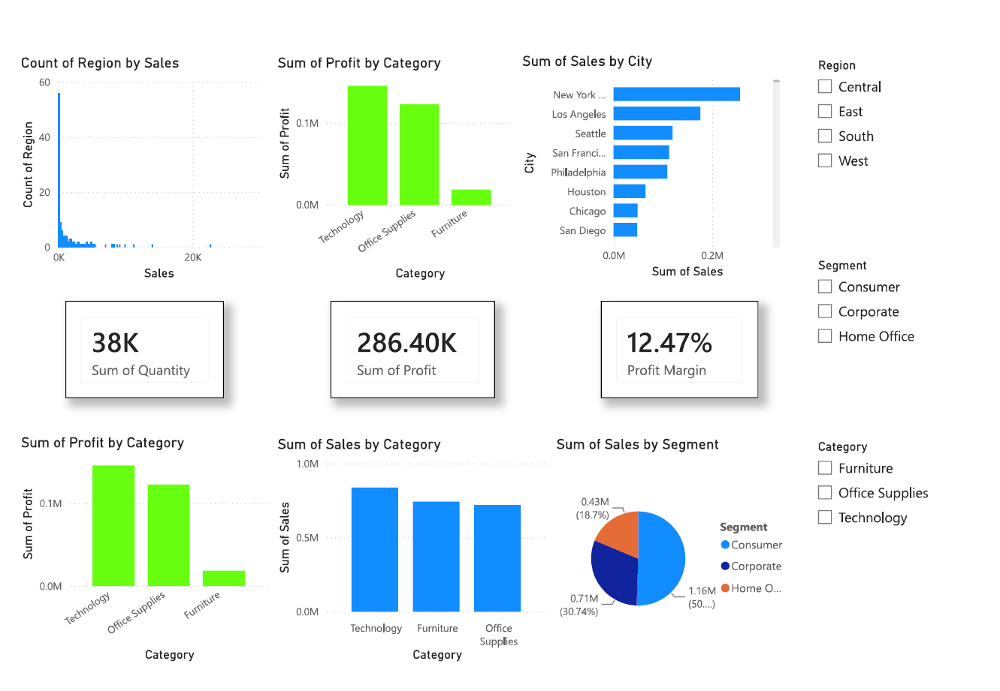

# superstore-sales-dashboard
Sales performance analysis using SQL, Excel, and Power BI
# Superstore Sales Performance Dashboard

## Business Problem
Analyse retail sales and profitability to guide category, region, 
and segment-level business decisions.

## Tools Used
SQL · Excel · Power BI

## Approach
- Queried and aggregated transactional sales data using SQL
- Cleaned and modelled data in Excel
- Built an interactive Power BI dashboard with KPI cards, 
  category/region breakdowns, and segment analysis

## Key Insights
- Technology category generated the highest sales revenue
- West region delivered the highest overall profit
- Consumer segment contributed the largest share of total sales
- High discounts on select products were eroding profit margins

## Dashboard Preview

## Files
- `report.pdf` — full written analysis
- `presentation.pptx` — stakeholder presentation
- `dashboard.pbix` — Power BI file
